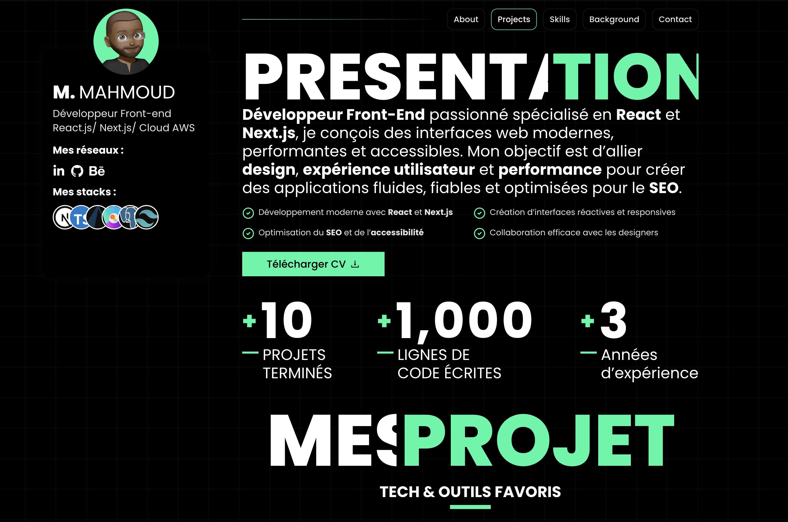

# 🚀 Portfolio – Mahmoud M


Portfolio personnel développé avec **Next.js**, mettant en avant mes projets, mes compétences front-end et mon expertise Cloud AWS.

🔗 Live Demo : https://portfolio-mahmoud-m.vercel.app/

---

## 📌 À propos du projet

Ce portfolio a été conçu pour :

- Présenter mes projets et réalisations
- Mettre en avant mes compétences React / Next.js
- Démontrer mes bonnes pratiques front-end
- Offrir une expérience moderne, performante et responsive

L'objectif est d’allier **design, performance, accessibilité et SEO**.

---

## 🛠️ Stack Technique

- **Next.js**
- **React.js**
- **TypeScript**
- **Tailwind CSS**
- **Vercel** (déploiement)

---

## ✨ Fonctionnalités

- Design moderne et responsive
- Optimisation SEO
- Navigation fluide
- Section projets dynamique
- Téléchargement de CV
- Architecture modulaire et scalable

---

## 📂 Structure du projet


Architecture pensée pour :
- Maintenabilité
- Scalabilité
- Séparation claire des responsabilités

---

## ⚡ Performance

- Optimisation des images
- Lazy loading
- Code splitting automatique avec Next.js
- Bon score Lighthouse

---

## 🚀 Installation locale

```bash
git clone https://github.com/ton-username/portfolio.git
cd portfolio
npm install
npm run dev
