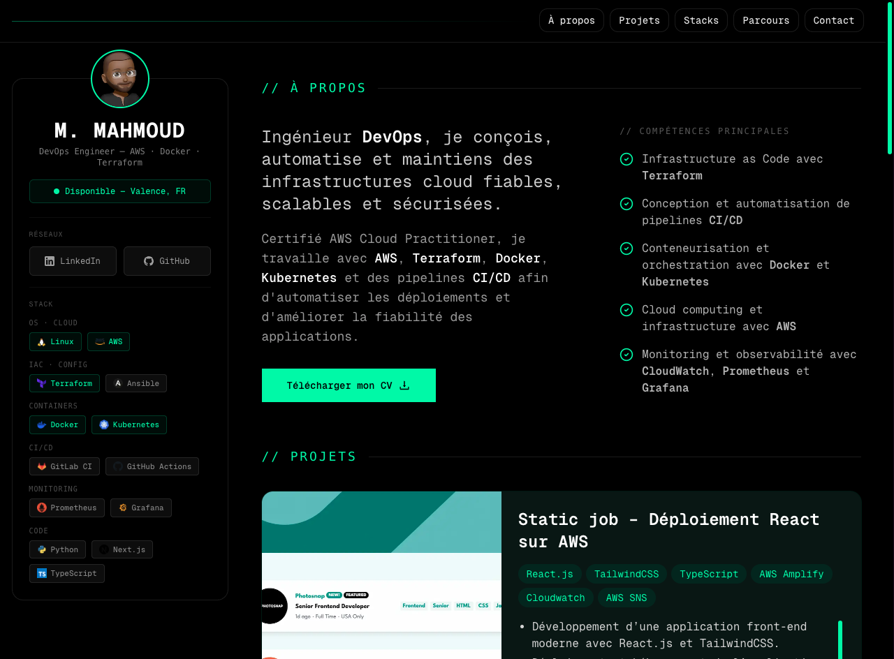

# ☁️ Portfolio Cloud & DevOps – Mahmoud M



Portfolio personnel développé avec **Next.js** pour présenter mon parcours, mes projets et mes compétences dans les domaines du **Cloud Computing**, du **DevOps** et de l’automatisation d’infrastructures.

🔗 **Portfolio :** https://portfolio-mahmoud-m.vercel.app/

---

## 👨‍💻 À propos

Je suis orienté **Cloud & DevOps**, avec un intérêt particulier pour l’automatisation, l’Infrastructure as Code, la conteneurisation et les environnements cloud.

Certifié **AWS Certified Cloud Practitioner**, je développe mes compétences autour de technologies telles que :

- **AWS**
- **Terraform**
- **Docker**
- **Kubernetes**
- **CI/CD**
- **GitHub Actions**
- **CloudWatch**
- **Prometheus**
- **Grafana**
- **Linux**

Ce portfolio me permet de présenter mes projets techniques ainsi que ma progression dans l’écosystème Cloud & DevOps.

---

## 🎯 Objectifs du portfolio

Ce portfolio a été conçu pour :

- Présenter mes projets **Cloud & DevOps**
- Mettre en avant mes compétences sur **AWS**
- Démontrer mes connaissances en **Infrastructure as Code**
- Présenter mes projets de conteneurisation avec **Docker**
- Mettre en avant l’orchestration avec **Kubernetes**
- Illustrer la mise en place de pipelines **CI/CD**
- Présenter mes compétences en monitoring et observabilité
- Centraliser mes réalisations techniques et certifications

---

## ☁️ Compétences Cloud & DevOps

### Amazon Web Services

Services et concepts AWS utilisés ou étudiés :

- EC2
- S3
- IAM
- VPC
- CloudWatch
- Route 53
- Elastic Load Balancing
- Auto Scaling
- RDS
- AWS CLI

### Infrastructure as Code

- **Terraform**
- Création et gestion d’infrastructures reproductibles
- Gestion des variables et outputs
- Organisation modulaire des infrastructures
- Gestion du state Terraform

### Conteneurisation

- **Docker**
- Création de Dockerfiles
- Gestion des images et conteneurs
- Docker Compose
- Optimisation des images

### Orchestration

- **Kubernetes**
- Pods
- Deployments
- Services
- ConfigMaps
- Secrets
- Scaling

### CI/CD

Automatisation des processus de build, test et déploiement avec :

- **GitHub Actions**
- Pipelines CI/CD
- Automatisation des déploiements
- Gestion des workflows

### Monitoring & Observabilité

- **AWS CloudWatch**
- **Prometheus**
- **Grafana**
- Monitoring des infrastructures
- Centralisation des métriques
- Visualisation des performances

---

## 🛠️ Stack du portfolio

Le portfolio lui-même est développé avec :

- **Next.js**
- **React**
- **TypeScript**
- **Tailwind CSS**
- **Vercel**

Le développement web reste utilisé ici comme support pour présenter mes projets et compétences Cloud & DevOps.

---

## ✨ Fonctionnalités

- Interface moderne et responsive
- Présentation des projets Cloud & DevOps
- Section dédiée aux compétences techniques
- Présentation des certifications
- Téléchargement du CV
- Navigation fluide
- Optimisation SEO
- Optimisation des performances
- Architecture modulaire

---

## 📂 Structure du projet

```text
portfolio/
│
├── public/
│   ├── images/
│   └── CV_Mahmoud.pdf
│
├── src/
│   ├── app/
│   ├── components/
│   ├── data/
│   └── lib/
│
├── package.json
├── tailwind.config.ts
├── tsconfig.json
└── README.md